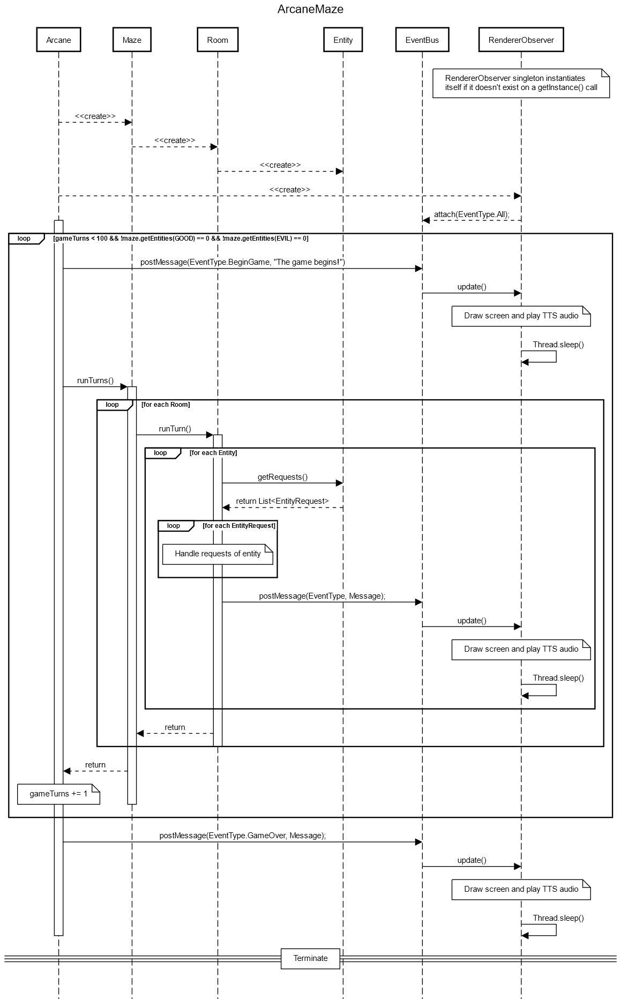

# Arcane

A class project for Object-Oriented Programming and Design using Java and Gradle. Simulates a maze filled with adventurers and monsters that explore and fight one another until only one side remains. The game can be rendered to a visual display and through TTS, or output to a log.

Implements each of the following patterns at least once:

- Observer
- Factory
- Builder
- Adapter
- Singleton

# Visuals

### Game output ([Link to video](https://youtu.be/KfPSCZAfvnY))

### Sequence diagram

